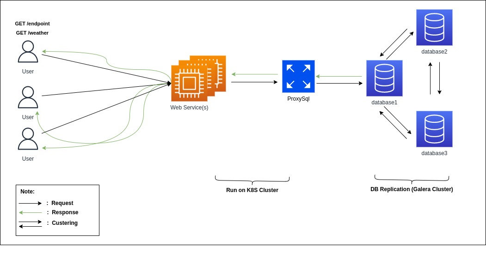

# service-go-restapi

## STUDY CASE

We want to deploy a simple REST API service in Golang which will be deployed on GCP or AWS.
The service will be running on Docker and should be accessible via the URL
**https://example.com/<QUERY_ENDPOINT>** , 

with the QUERY_ENDPOINT consist of :

●  `/endpoint `, returning a call from a database with just one dummy table of 1 record, and return in JSON formatted

● `/weather`, returning a current weather prediction for Jakarta in JSON format. You can
proxy this call to weather provider that provide API call for this

The deployment should be able to handler a 10k concurrent user
From the information above :
1. Please create the design architecture in the form of a diagram.
2. In addition, also include brief descriptions on the items below :
   - List the underlying techstack you believe is required to run the REST API + why
   - How you would setup the Database replication
   - Network Subnet design
   - Security Groups between network groupings
3. Terraform script for infrastructure provisioning. The script should be organized in such a
way that it is Modular, Reusable, Supports Multiple Environments and Easily
Configurable. The script should provision whatever you specify on question number 2.
4. Create the deployment pipeline - preferably in Gitlab CI YAML, but Github or Bitbucket
pipeline is also acceptable - to perform the tasks below :
   - Run the Terraform script above to provision the underlying infrastructure.
   - Create a Dockerfile with Alpine base image and install the application into the container
   - Deploy the resulting docker to the targeted instance(s)
5. Your build and deployment in number 4 should be a deterministic Docker build with
verified image result (sign the image before deploy), and the resulting image should be
secure and hardened free from any kind of CVE
6. Regardless of the provisioning in number 3, you should also provision observability
mechanics to observe (trace, log. get metrics) from your Deployment
  

## Solution
---
The architecture design that I made, accordingly with the diagram below:
  

The Underlying techstack that I Used on to run REST API Services:
1. Web Service, using **NGINX**  
The most powerful as a web service and usually used on Server (Linux). We can adjust all of parameters that built in on Nginx like paramteres for logging, add proxy server and so on. We  can set Nginx as Web Server, LoadBalancer, or reverse proxy. But, for this case we need setup as a web server. If we deploy web services on Kubernetes cluster (K8S), the orchestrator based on container we only setup node masters and workers for handle deployment services running on container.

2. Mariadb + galera cluster
Mariadb is database relational opensource built in, that we handle this GET Request And Galera as a clustering mariadb for replication data. 

3. ProxySQL
Proxysql is a high performance opensource technology for MySQL (Mariadb).
It's useful because we only need expose 1 IP address for accesing the database cluster without need to expose all of IP address based on database server. We can configure how the database server can handle read only or write only

4. Framework Golang v.1.16.15, with Gin Framework as a HTTP web

- as mention above, for database replication we are using Galera Clustering that technology replication data for Mariadb.

- for the network subnet design:  
All of service below using Operating System Linux based and define on local network (private)  
  ``Subnet IP = 192.168.41.0/24``  
    | no.  | Type Application  | IP Pools                     | Note                             |
    | :---:|  :---:            | :---                         | :---                             |
    | 1    | Nginx             | 192.168.41.2-192.168.41.19   | reserved for next web Service       |
    | 2    | Mariadb           | 192.168.41.21-192.168.41.23  | reserved for next Maridb Service    |
    | 3    | ProxySQL          | 192.168.41.1                 |   -                              |

- List Of security Groups:  
    | no.  | Name security Group  | Description        | Direction       | Port range | Remote API Prefix| Assign to Service|
    | :---:|  :---:     | :---                         | :---            | :---       | :---             | :---|
    | 1    | HTTP       | Allow port HTTP              | Ingress         | 80 , 8080  | 0.0.0.0/0        | Nginx |
    | 2    | HTTPS      | Allow port HTTPS             | Ingress         | 443        | 0.0.0.0/0        | Nginx |
    | 3    | MYSQL      | Allow port MYSQL             | Ingress         | 3306       | 192.168.41.0/24  | Mariadb, Nginx, ProxySQL |
    | 4    | PROXYSQL   | Allow port dashboard proxysql| Ingress         | 6032       | 192.168.41.0/24  | ProxySQL |
    | 5    | ICMP       | Allow port MYSQL             | Egress , Ingress| any        | 0.0.0.0/0        | Nginx, Mariadb, ProxySQL |
    | 6    | SSH        | Allow port SSH               | Ingress         | 22         | 192.168.41.0/24, trusted network  | Nginx, Mariadb, ProxySQL |